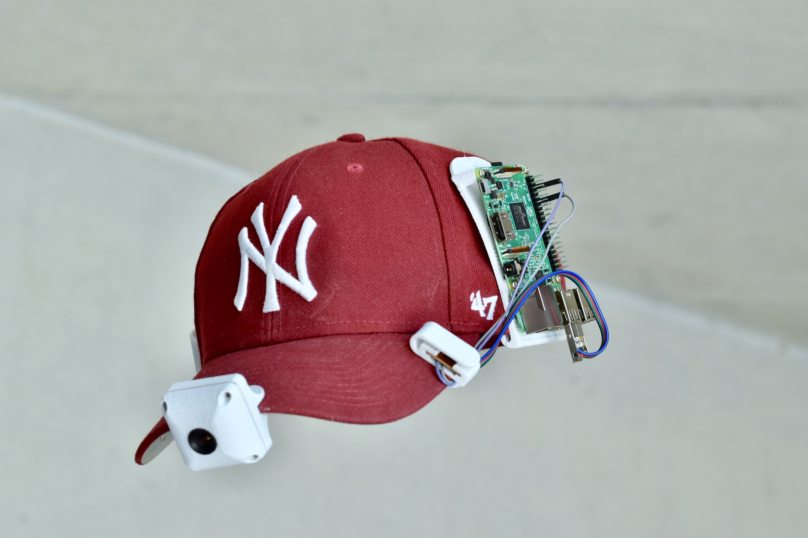

My project is a camera controlled by a raspberry pi that is attached to a hat. This camera is constantly on, it films everything, but records only the last 7 seconds of videos. Let's take an example, imagine you are walking in the street and you see a meteorite in the sky, obviously you don't have time to take your phone to film it, fortunatly after the passage of the meteorite, you just have to press a button on the hat and the camera will record the last 7 seconds. Then you can download the video from an application on your phone.

With a normal camera you press the button before something happens, but with this camera it's the opposite !

More pictures : http://johanlink.atwebpages.com/pages/hat.html
My website : http://johanlink.atwebpages.com

